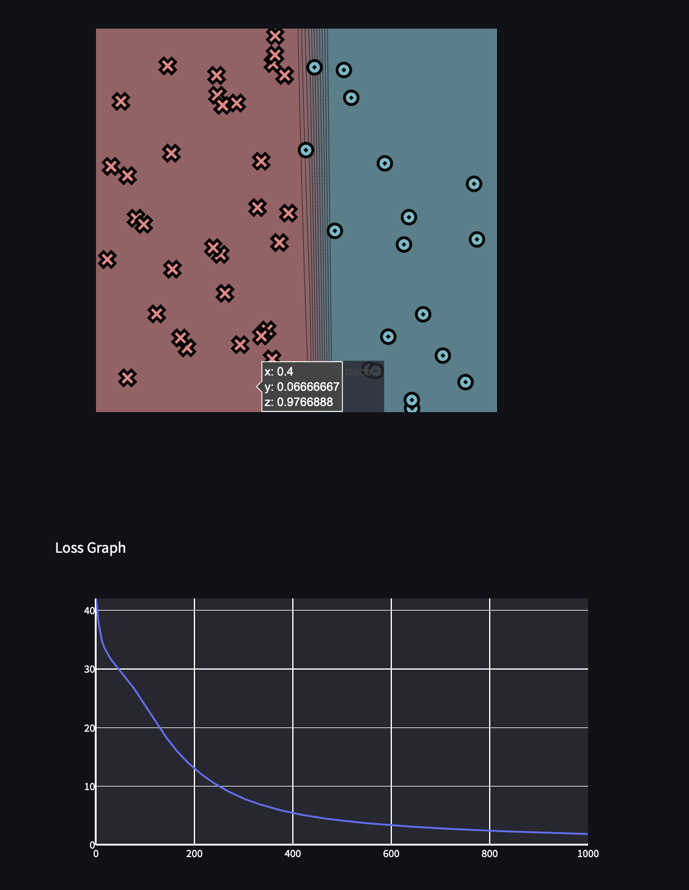
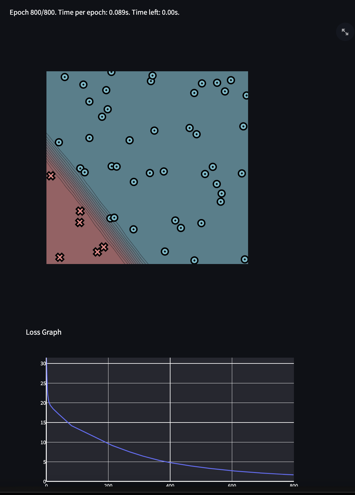
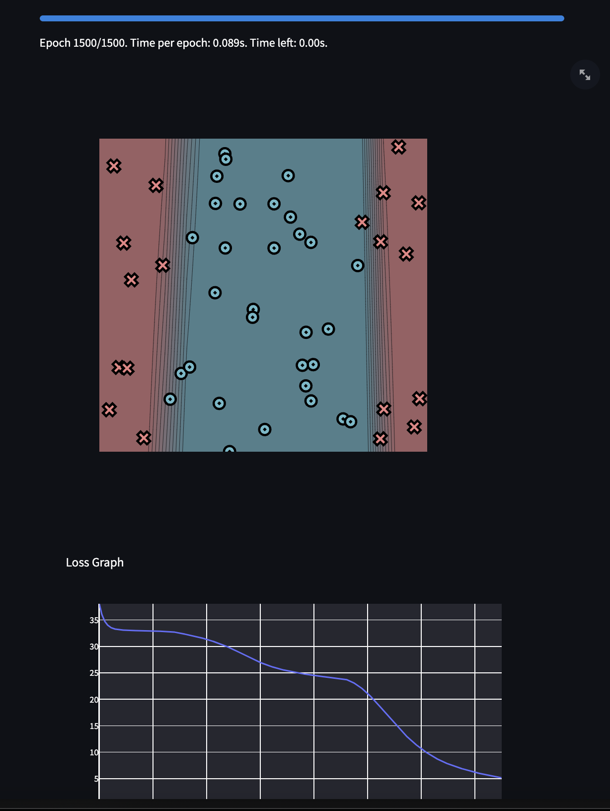
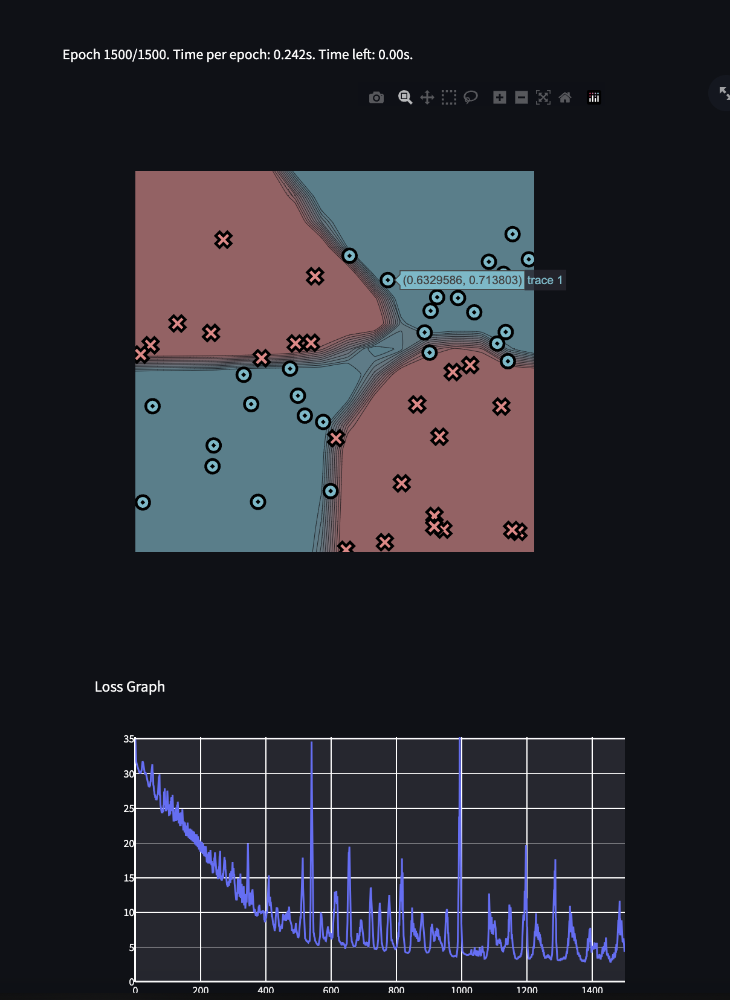

[](https://classroom.github.com/a/YFgwt0yY)
# MiniTorch Module 2


* Docs: https://minitorch.github.io/

* Overview: https://minitorch.github.io/module2/module2/

This assignment requires the following files from the previous assignments. You can get these by running

```bash
# python sync_previous_module.py previous-module-dir current-module-dir
```

The files that will be synced are:

        minitorch/operators.py minitorch/module.py minitorch/autodiff.py minitorch/scalar.py minitorch/scalar_functions.py minitorch/module.py project/run_manual.py project/run_scalar.py project/datasets.py


# Training Results

## Simple
* hidden layers: 2
* Learning rate: 0.1
* Number of Epochs: 1000
* Average time per epoch: 0.0327 seconds

```
Epoch: 0/1000, loss: 0, correct: 0
Epoch: 10/1000, loss: 36.00252926556984, correct: 18
Time for epoch 10: 0.0368 seconds
Epoch: 20/1000, loss: 33.27703114199928, correct: 18
Time for epoch 20: 0.0333 seconds
Epoch: 30/1000, loss: 31.816446111165, correct: 42
Time for epoch 30: 0.0313 seconds
Epoch: 40/1000, loss: 30.683286946991675, correct: 45
Time for epoch 40: 0.0306 seconds
Epoch: 50/1000, loss: 29.68428563183042, correct: 44
Time for epoch 50: 0.0307 seconds
Epoch: 60/1000, loss: 28.690831892670456, correct: 44
Time for epoch 60: 0.0304 seconds
Epoch: 70/1000, loss: 27.625629720163452, correct: 44
Time for epoch 70: 0.0306 seconds
Epoch: 80/1000, loss: 26.463985401022228, correct: 45
Time for epoch 80: 0.0306 seconds
Epoch: 90/1000, loss: 25.230396974101797, correct: 45
Time for epoch 90: 0.0304 seconds
Epoch: 100/1000, loss: 23.916278882755247, correct: 46
Time for epoch 100: 0.0301 seconds
Epoch: 110/1000, loss: 22.599484262880885, correct: 46
Time for epoch 110: 0.0304 seconds
Epoch: 120/1000, loss: 21.302948408480177, correct: 46
Time for epoch 120: 0.0302 seconds
Epoch: 130/1000, loss: 20.029267043847632, correct: 47
Time for epoch 130: 0.0299 seconds
Epoch: 140/1000, loss: 18.79263285038433, correct: 47
Time for epoch 140: 0.0303 seconds
Epoch: 150/1000, loss: 17.626806541060773, correct: 47
Time for epoch 150: 0.0303 seconds
Epoch: 160/1000, loss: 16.558596036706955, correct: 47
Time for epoch 160: 0.0309 seconds
Epoch: 170/1000, loss: 15.573453584021395, correct: 48
Time for epoch 170: 0.0303 seconds
Epoch: 180/1000, loss: 14.679982328875534, correct: 48
Time for epoch 180: 0.0301 seconds
Epoch: 190/1000, loss: 13.862947383184066, correct: 48
Time for epoch 190: 0.0301 seconds
Epoch: 200/1000, loss: 13.097900530840171, correct: 48
Time for epoch 200: 0.0302 seconds
Epoch: 210/1000, loss: 12.397024819402962, correct: 48
Time for epoch 210: 0.0301 seconds
Epoch: 220/1000, loss: 11.745759719476164, correct: 48
Time for epoch 220: 0.0302 seconds
Epoch: 230/1000, loss: 11.135001562608325, correct: 48
Time for epoch 230: 0.0310 seconds
Epoch: 240/1000, loss: 10.572936709667136, correct: 48
Time for epoch 240: 0.0305 seconds
Epoch: 250/1000, loss: 10.057989012642356, correct: 48
Time for epoch 250: 0.0301 seconds
Epoch: 260/1000, loss: 9.57563660147489, correct: 48
Time for epoch 260: 0.0304 seconds
Epoch: 270/1000, loss: 9.124284434384883, correct: 48
Time for epoch 270: 0.0303 seconds
Epoch: 280/1000, loss: 8.702446143092432, correct: 48
Time for epoch 280: 0.0302 seconds
Epoch: 290/1000, loss: 8.308645763610105, correct: 48
Time for epoch 290: 0.0300 seconds
Epoch: 300/1000, loss: 7.941379618241445, correct: 48
Time for epoch 300: 0.0295 seconds
Epoch: 310/1000, loss: 7.611281920685847, correct: 49
Time for epoch 310: 0.0302 seconds
Epoch: 320/1000, loss: 7.306228927089532, correct: 49
Time for epoch 320: 0.0306 seconds
Epoch: 330/1000, loss: 7.020531005842295, correct: 49
Time for epoch 330: 0.0303 seconds
Epoch: 340/1000, loss: 6.752900487272306, correct: 49
Time for epoch 340: 0.0304 seconds
Epoch: 350/1000, loss: 6.5021141224363195, correct: 49
Time for epoch 350: 0.0307 seconds
Epoch: 360/1000, loss: 6.267007248712987, correct: 49
Time for epoch 360: 0.0308 seconds
Epoch: 370/1000, loss: 6.046472756274624, correct: 49
Time for epoch 370: 0.0299 seconds
Epoch: 380/1000, loss: 5.8394621877965145, correct: 49
Time for epoch 380: 0.0302 seconds
Epoch: 390/1000, loss: 5.644987317500385, correct: 49
Time for epoch 390: 0.0305 seconds
Epoch: 400/1000, loss: 5.462121285566757, correct: 49
Time for epoch 400: 0.0307 seconds
Epoch: 410/1000, loss: 5.289998867905735, correct: 49
Time for epoch 410: 0.0304 seconds
Epoch: 420/1000, loss: 5.127815780096345, correct: 49
Time for epoch 420: 0.0310 seconds
Epoch: 430/1000, loss: 4.977886978476728, correct: 49
Time for epoch 430: 0.0305 seconds
Epoch: 440/1000, loss: 4.8374698886846055, correct: 49
Time for epoch 440: 0.0306 seconds
Epoch: 450/1000, loss: 4.704438894835669, correct: 49
Time for epoch 450: 0.0306 seconds
Epoch: 460/1000, loss: 4.578677665867557, correct: 49
Time for epoch 460: 0.0308 seconds
Epoch: 470/1000, loss: 4.462227618555476, correct: 49
Time for epoch 470: 0.0306 seconds
Epoch: 480/1000, loss: 4.351821681895796, correct: 49
Time for epoch 480: 0.0307 seconds
Epoch: 490/1000, loss: 4.246580728726375, correct: 50
Time for epoch 490: 0.0304 seconds
Epoch: 500/1000, loss: 4.146148605560735, correct: 50
Time for epoch 500: 0.0310 seconds
Epoch: 510/1000, loss: 4.050175849428316, correct: 50
Time for epoch 510: 0.0304 seconds
Epoch: 520/1000, loss: 3.9583688413628115, correct: 50
Time for epoch 520: 0.0305 seconds
Epoch: 530/1000, loss: 3.870460776009502, correct: 50
Time for epoch 530: 0.0302 seconds
Epoch: 540/1000, loss: 3.7865733170309093, correct: 50
Time for epoch 540: 0.0301 seconds
Epoch: 550/1000, loss: 3.7068903761420864, correct: 50
Time for epoch 550: 0.0299 seconds
Epoch: 560/1000, loss: 3.631111746958324, correct: 50
Time for epoch 560: 0.0300 seconds
Epoch: 570/1000, loss: 3.5582356346595834, correct: 50
Time for epoch 570: 0.0303 seconds
Epoch: 580/1000, loss: 3.488095678909333, correct: 50
Time for epoch 580: 0.0303 seconds
Epoch: 590/1000, loss: 3.4205385522165597, correct: 50
Time for epoch 590: 0.0304 seconds
Epoch: 600/1000, loss: 3.355423598432159, correct: 50
Time for epoch 600: 0.0299 seconds
Epoch: 610/1000, loss: 3.2926159220678866, correct: 50
Time for epoch 610: 0.0304 seconds
Epoch: 620/1000, loss: 3.23199268479197, correct: 50
Time for epoch 620: 0.0300 seconds
Epoch: 630/1000, loss: 3.173439536213606, correct: 50
Time for epoch 630: 0.0302 seconds
Epoch: 640/1000, loss: 3.116849907045804, correct: 50
Time for epoch 640: 0.0304 seconds
Epoch: 650/1000, loss: 3.062764833894092, correct: 50
Time for epoch 650: 0.0307 seconds
Epoch: 660/1000, loss: 3.0105890725033966, correct: 50
Time for epoch 660: 0.0303 seconds
Epoch: 670/1000, loss: 2.960314867763127, correct: 50
Time for epoch 670: 0.0309 seconds
Epoch: 680/1000, loss: 2.9116511026099765, correct: 50
Time for epoch 680: 0.0303 seconds
Epoch: 690/1000, loss: 2.86450308028937, correct: 50
Time for epoch 690: 0.0304 seconds
Epoch: 700/1000, loss: 2.818786458043708, correct: 50
Time for epoch 700: 0.0305 seconds
Epoch: 710/1000, loss: 2.7744254587377246, correct: 50
Time for epoch 710: 0.0312 seconds
Epoch: 720/1000, loss: 2.7313514694895566, correct: 50
Time for epoch 720: 0.0305 seconds
Epoch: 730/1000, loss: 2.6895019345959743, correct: 50
Time for epoch 730: 0.0309 seconds
Epoch: 740/1000, loss: 2.6488194737909585, correct: 50
Time for epoch 740: 0.0309 seconds
Epoch: 750/1000, loss: 2.6092511740136586, correct: 50
Time for epoch 750: 0.0314 seconds
Epoch: 760/1000, loss: 2.5707480155331925, correct: 50
Time for epoch 760: 0.0304 seconds
Epoch: 770/1000, loss: 2.5332644027084834, correct: 50
Time for epoch 770: 0.0301 seconds
Epoch: 780/1000, loss: 2.496757776718075, correct: 50
Time for epoch 780: 0.0305 seconds
Epoch: 790/1000, loss: 2.461188292902236, correct: 50
Time for epoch 790: 0.0302 seconds
Epoch: 800/1000, loss: 2.4265185493677563, correct: 50
Time for epoch 800: 0.0302 seconds
Epoch: 810/1000, loss: 2.3927133565447245, correct: 50
Time for epoch 810: 0.0318 seconds
Epoch: 820/1000, loss: 2.359739539697415, correct: 50
Time for epoch 820: 0.0317 seconds
Epoch: 830/1000, loss: 2.327565768157174, correct: 50
Time for epoch 830: 0.0311 seconds
Epoch: 840/1000, loss: 2.2961624063978587, correct: 50
Time for epoch 840: 0.0310 seconds
Epoch: 850/1000, loss: 2.2655013831143758, correct: 50
Time for epoch 850: 0.0312 seconds
Epoch: 860/1000, loss: 2.2355560752665173, correct: 50
Time for epoch 860: 0.0308 seconds
Epoch: 870/1000, loss: 2.2063012046708805, correct: 50
Time for epoch 870: 0.0307 seconds
Epoch: 880/1000, loss: 2.177712745205301, correct: 50
Time for epoch 880: 0.0306 seconds
Epoch: 890/1000, loss: 2.1497678390658335, correct: 50
Time for epoch 890: 0.0310 seconds
Epoch: 900/1000, loss: 2.122444720810328, correct: 50
Time for epoch 900: 0.0308 seconds
Epoch: 910/1000, loss: 2.095722648153361, correct: 50
Time for epoch 910: 0.0304 seconds
Epoch: 920/1000, loss: 2.069581838660049, correct: 50
Time for epoch 920: 0.0307 seconds
Epoch: 930/1000, loss: 2.044003411630536, correct: 50
Time for epoch 930: 0.0307 seconds
Epoch: 940/1000, loss: 2.0189693345829536, correct: 50
Time for epoch 940: 0.0308 seconds
Epoch: 950/1000, loss: 1.9944623738347538, correct: 50
Time for epoch 950: 0.0302 seconds
Epoch: 960/1000, loss: 1.970466048757585, correct: 50
Time for epoch 960: 0.0303 seconds
Epoch: 970/1000, loss: 1.9469645893412844, correct: 50
Time for epoch 970: 0.0300 seconds
Epoch: 980/1000, loss: 1.9239428967525387, correct: 50
Time for epoch 980: 0.0303 seconds
Epoch: 990/1000, loss: 1.901386506614561, correct: 50
Time for epoch 990: 0.0303 seconds
Epoch: 1000/1000, loss: 1.8792815547681547, correct: 50
Time for epoch 1000: 0.0303 seconds
```


## Diag
* hidden layers: 4
* Learning rate: 0.1
* Number of Epochs: 800
* Average time per epoch: 0.0321 seconds

```
Epoch: 0/800, loss: 0, correct: 0
Epoch: 10/800, loss: 18.29344603879422, correct: 44
Time for epoch 10: 0.0314 seconds
Epoch: 20/800, loss: 14.257829624866645, correct: 44
Time for epoch 20: 0.0301 seconds
Epoch: 30/800, loss: 12.99651107263622, correct: 44
Time for epoch 30: 0.0306 seconds
Epoch: 40/800, loss: 12.418403427068977, correct: 44
Time for epoch 40: 0.0311 seconds
Epoch: 50/800, loss: 11.971781320455754, correct: 44
Time for epoch 50: 0.0301 seconds
Epoch: 60/800, loss: 11.532753810778363, correct: 44
Time for epoch 60: 0.0321 seconds
Epoch: 70/800, loss: 11.12364070471365, correct: 44
Time for epoch 70: 0.0309 seconds
Epoch: 80/800, loss: 10.776830084166544, correct: 44
Time for epoch 80: 0.0316 seconds
Epoch: 90/800, loss: 10.427240418788665, correct: 44
Time for epoch 90: 0.0307 seconds
Epoch: 100/800, loss: 10.07148704581124, correct: 44
Time for epoch 100: 0.0309 seconds
Epoch: 110/800, loss: 9.711172523535305, correct: 44
Time for epoch 110: 0.0307 seconds
Epoch: 120/800, loss: 9.348979843036219, correct: 44
Time for epoch 120: 0.0305 seconds
Epoch: 130/800, loss: 8.987832979359275, correct: 44
Time for epoch 130: 0.0303 seconds
Epoch: 140/800, loss: 8.64373727851981, correct: 44
Time for epoch 140: 0.0390 seconds
Epoch: 150/800, loss: 8.356242076571094, correct: 44
Time for epoch 150: 0.0313 seconds
Epoch: 160/800, loss: 8.086793543269941, correct: 44
Time for epoch 160: 0.0306 seconds
Epoch: 170/800, loss: 7.82419542693773, correct: 44
Time for epoch 170: 0.0303 seconds
Epoch: 180/800, loss: 7.56801024806518, correct: 44
Time for epoch 180: 0.0305 seconds
Epoch: 190/800, loss: 7.318879660102457, correct: 44
Time for epoch 190: 0.0306 seconds
Epoch: 200/800, loss: 7.077393336294814, correct: 44
Time for epoch 200: 0.0305 seconds
Epoch: 210/800, loss: 6.8499150947014895, correct: 44
Time for epoch 210: 0.0300 seconds
Epoch: 220/800, loss: 6.643777483923731, correct: 44
Time for epoch 220: 0.0303 seconds
Epoch: 230/800, loss: 6.447093572452732, correct: 48
Time for epoch 230: 0.0308 seconds
Epoch: 240/800, loss: 6.268019939012738, correct: 48
Time for epoch 240: 0.0299 seconds
Epoch: 250/800, loss: 6.098177005971445, correct: 48
Time for epoch 250: 0.0300 seconds
Epoch: 260/800, loss: 5.936496679745718, correct: 48
Time for epoch 260: 0.0310 seconds
Epoch: 270/800, loss: 5.780931613732314, correct: 48
Time for epoch 270: 0.0300 seconds
Epoch: 280/800, loss: 5.6313903059928805, correct: 48
Time for epoch 280: 0.0301 seconds
Epoch: 290/800, loss: 5.487616506487586, correct: 48
Time for epoch 290: 0.0304 seconds
Epoch: 300/800, loss: 5.347653745797892, correct: 48
Time for epoch 300: 0.0300 seconds
Epoch: 310/800, loss: 5.214511396823856, correct: 48
Time for epoch 310: 0.0303 seconds
Epoch: 320/800, loss: 5.084866460937016, correct: 48
Time for epoch 320: 0.0301 seconds
Epoch: 330/800, loss: 4.960733695694101, correct: 48
Time for epoch 330: 0.0301 seconds
Epoch: 340/800, loss: 4.83929901470551, correct: 48
Time for epoch 340: 0.0303 seconds
Epoch: 350/800, loss: 4.7238292486822955, correct: 49
Time for epoch 350: 0.0304 seconds
Epoch: 360/800, loss: 4.6116992463153155, correct: 50
Time for epoch 360: 0.0300 seconds
Epoch: 370/800, loss: 4.5023771522357015, correct: 50
Time for epoch 370: 0.0299 seconds
Epoch: 380/800, loss: 4.39587361850676, correct: 50
Time for epoch 380: 0.0304 seconds
Epoch: 390/800, loss: 4.2927738547220065, correct: 50
Time for epoch 390: 0.0305 seconds
Epoch: 400/800, loss: 4.196739569068956, correct: 50
Time for epoch 400: 0.0303 seconds
Epoch: 410/800, loss: 4.098002296198862, correct: 50
Time for epoch 410: 0.0302 seconds
Epoch: 420/800, loss: 4.008508699189992, correct: 50
Time for epoch 420: 0.0302 seconds
Epoch: 430/800, loss: 3.916678163963846, correct: 50
Time for epoch 430: 0.0302 seconds
Epoch: 440/800, loss: 3.8290251984911414, correct: 50
Time for epoch 440: 0.0303 seconds
Epoch: 450/800, loss: 3.747156988377283, correct: 50
Time for epoch 450: 0.0300 seconds
Epoch: 460/800, loss: 3.666187429948616, correct: 50
Time for epoch 460: 0.0299 seconds
Epoch: 470/800, loss: 3.587110256549954, correct: 50
Time for epoch 470: 0.0302 seconds
Epoch: 480/800, loss: 3.5102903507670797, correct: 50
Time for epoch 480: 0.0301 seconds
Epoch: 490/800, loss: 3.435713409362226, correct: 50
Time for epoch 490: 0.0304 seconds
Epoch: 500/800, loss: 3.363301859596666, correct: 50
Time for epoch 500: 0.0303 seconds
Epoch: 510/800, loss: 3.292971438233706, correct: 50
Time for epoch 510: 0.0304 seconds
Epoch: 520/800, loss: 3.224640623005057, correct: 50
Time for epoch 520: 0.0303 seconds
Epoch: 530/800, loss: 3.1582320097888736, correct: 50
Time for epoch 530: 0.0300 seconds
Epoch: 540/800, loss: 3.093672350317879, correct: 50
Time for epoch 540: 0.0303 seconds
Epoch: 550/800, loss: 3.030892370807305, correct: 50
Time for epoch 550: 0.0302 seconds
Epoch: 560/800, loss: 2.969866927991356, correct: 50
Time for epoch 560: 0.0300 seconds
Epoch: 570/800, loss: 2.9137279006279804, correct: 50
Time for epoch 570: 0.0304 seconds
Epoch: 580/800, loss: 2.853973968271738, correct: 50
Time for epoch 580: 0.0298 seconds
Epoch: 590/800, loss: 2.8009288574685374, correct: 50
Time for epoch 590: 0.0304 seconds
Epoch: 600/800, loss: 2.745181857825664, correct: 50
Time for epoch 600: 0.0301 seconds
Epoch: 610/800, loss: 2.6929270240274086, correct: 50
Time for epoch 610: 0.0303 seconds
Epoch: 620/800, loss: 2.645374686419471, correct: 50
Time for epoch 620: 0.0302 seconds
Epoch: 630/800, loss: 2.5976859164484383, correct: 50
Time for epoch 630: 0.0298 seconds
Epoch: 640/800, loss: 2.5465748454276347, correct: 50
Time for epoch 640: 0.0299 seconds
Epoch: 650/800, loss: 2.4978470535170776, correct: 50
Time for epoch 650: 0.0301 seconds
Epoch: 660/800, loss: 2.457103399845288, correct: 50
Time for epoch 660: 0.0299 seconds
Epoch: 670/800, loss: 2.413789166082897, correct: 50
Time for epoch 670: 0.0299 seconds
Epoch: 680/800, loss: 2.3704889222862753, correct: 50
Time for epoch 680: 0.0300 seconds
Epoch: 690/800, loss: 2.3236333029682994, correct: 50
Time for epoch 690: 0.0297 seconds
Epoch: 700/800, loss: 2.285271312223438, correct: 50
Time for epoch 700: 0.0368 seconds
Epoch: 710/800, loss: 2.2508221187965787, correct: 50
Time for epoch 710: 0.0300 seconds
Epoch: 720/800, loss: 2.2055435762361166, correct: 50
Time for epoch 720: 0.0304 seconds
Epoch: 730/800, loss: 2.1731522274152186, correct: 50
Time for epoch 730: 0.0300 seconds
Epoch: 740/800, loss: 2.1306855588781315, correct: 50
Time for epoch 740: 0.0301 seconds
Epoch: 750/800, loss: 2.099728509868441, correct: 50
Time for epoch 750: 0.0303 seconds
Epoch: 760/800, loss: 2.0651246922297593, correct: 50
Time for epoch 760: 0.0301 seconds
Epoch: 770/800, loss: 2.0300600956925847, correct: 50
Time for epoch 770: 0.0305 seconds
Epoch: 780/800, loss: 1.9960137702305976, correct: 50
Time for epoch 780: 0.0298 seconds
Epoch: 790/800, loss: 1.9640325532370178, correct: 50
Time for epoch 790: 0.0302 seconds
Epoch: 800/800, loss: 1.9309892007361753, correct: 50
Time for epoch 800: 0.0301 seconds
```


## Split
* hidden layers: 4
* Learning rate: 0.1
* Number of Epochs: 1500
* Average time per epoch: 0.0739 seconds
```
Epoch: 10/1500, loss: 36.111627336879984, correct: 19
Time for epoch 10: 0.0703 seconds
Epoch: 20/1500, loss: 34.87398313499146, correct: 19
Time for epoch 20: 0.0709 seconds
Epoch: 30/1500, loss: 34.13895522243968, correct: 35
Time for epoch 30: 0.0708 seconds
Epoch: 40/1500, loss: 33.69718453955298, correct: 31
Time for epoch 40: 0.0704 seconds
Epoch: 50/1500, loss: 33.4363024094375, correct: 31
Time for epoch 50: 0.0708 seconds
Epoch: 60/1500, loss: 33.2777155652836, correct: 31
Time for epoch 60: 0.0709 seconds
Epoch: 70/1500, loss: 33.18263114683186, correct: 31
Time for epoch 70: 0.0711 seconds
Epoch: 80/1500, loss: 33.121564674114694, correct: 31
Time for epoch 80: 0.0768 seconds
Epoch: 90/1500, loss: 33.08088985181788, correct: 31
Time for epoch 90: 0.0777 seconds
Epoch: 100/1500, loss: 33.05244788879062, correct: 31
Time for epoch 100: 0.0709 seconds
Epoch: 110/1500, loss: 33.031563470898476, correct: 31
Time for epoch 110: 0.0714 seconds
Epoch: 120/1500, loss: 33.01518122512436, correct: 31
Time for epoch 120: 0.0707 seconds
Epoch: 130/1500, loss: 33.00140425145723, correct: 31
Time for epoch 130: 0.0715 seconds
Epoch: 140/1500, loss: 32.989144860599474, correct: 31
Time for epoch 140: 0.0766 seconds
Epoch: 150/1500, loss: 32.97759353921037, correct: 31
Time for epoch 150: 0.0717 seconds
Epoch: 160/1500, loss: 32.96636838374656, correct: 31
Time for epoch 160: 0.0736 seconds
Epoch: 170/1500, loss: 32.95515691654066, correct: 31
Time for epoch 170: 0.0712 seconds
Epoch: 180/1500, loss: 32.943772163238734, correct: 31
Time for epoch 180: 0.0749 seconds
Epoch: 190/1500, loss: 32.93204711964325, correct: 31
Time for epoch 190: 0.0734 seconds
Epoch: 200/1500, loss: 32.919984293899795, correct: 31
Time for epoch 200: 0.0786 seconds
Epoch: 210/1500, loss: 32.90743351310556, correct: 31
Time for epoch 210: 0.0713 seconds
Epoch: 220/1500, loss: 32.89441977028709, correct: 31
Time for epoch 220: 0.0717 seconds
Epoch: 230/1500, loss: 32.880857160617765, correct: 31
Time for epoch 230: 0.0745 seconds
Epoch: 240/1500, loss: 32.86284639668559, correct: 31
Time for epoch 240: 0.0728 seconds
Epoch: 250/1500, loss: 32.82904369864446, correct: 31
Time for epoch 250: 0.0856 seconds
Epoch: 260/1500, loss: 32.80082412202474, correct: 31
Time for epoch 260: 0.1081 seconds
Epoch: 270/1500, loss: 32.77368587370599, correct: 31
Time for epoch 270: 0.0709 seconds
Epoch: 280/1500, loss: 32.71780013079456, correct: 31
Time for epoch 280: 0.0707 seconds
Epoch: 290/1500, loss: 32.6016807184449, correct: 31
Time for epoch 290: 0.0746 seconds
Epoch: 300/1500, loss: 32.500826680329055, correct: 31
Time for epoch 300: 0.0717 seconds
Epoch: 310/1500, loss: 32.415656855725295, correct: 31
Time for epoch 310: 0.0710 seconds
Epoch: 320/1500, loss: 32.32505420695302, correct: 31
Time for epoch 320: 0.0706 seconds
Epoch: 330/1500, loss: 32.225254195034296, correct: 31
Time for epoch 330: 0.0707 seconds
Epoch: 340/1500, loss: 32.117202560278216, correct: 31
Time for epoch 340: 0.0706 seconds
Epoch: 350/1500, loss: 32.004098773103685, correct: 31
Time for epoch 350: 0.0705 seconds
Epoch: 360/1500, loss: 31.89298980431977, correct: 31
Time for epoch 360: 0.0709 seconds
Epoch: 370/1500, loss: 31.773783721370254, correct: 31
Time for epoch 370: 0.0707 seconds
Epoch: 380/1500, loss: 31.647200998646237, correct: 32
Time for epoch 380: 0.0713 seconds
Epoch: 390/1500, loss: 31.51125159480229, correct: 33
Time for epoch 390: 0.0733 seconds
Epoch: 400/1500, loss: 31.364987401287898, correct: 33
Time for epoch 400: 0.0710 seconds
Epoch: 410/1500, loss: 31.20811818613709, correct: 33
Time for epoch 410: 0.0706 seconds
Epoch: 420/1500, loss: 31.043081516917777, correct: 33
Time for epoch 420: 0.0717 seconds
Epoch: 430/1500, loss: 30.879908823637667, correct: 35
Time for epoch 430: 0.0721 seconds
Epoch: 440/1500, loss: 30.707926981948297, correct: 35
Time for epoch 440: 0.0717 seconds
Epoch: 450/1500, loss: 30.525509871003205, correct: 36
Time for epoch 450: 0.0728 seconds
Epoch: 460/1500, loss: 30.332098119010293, correct: 38
Time for epoch 460: 0.0708 seconds
Epoch: 470/1500, loss: 30.126603344251958, correct: 39
Time for epoch 470: 0.0769 seconds
Epoch: 480/1500, loss: 29.912488273240523, correct: 40
Time for epoch 480: 0.0826 seconds
Epoch: 490/1500, loss: 29.687245608669045, correct: 40
Time for epoch 490: 0.0715 seconds
Epoch: 500/1500, loss: 29.449892973547346, correct: 40
Time for epoch 500: 0.0706 seconds
Epoch: 510/1500, loss: 29.20412084652192, correct: 40
Time for epoch 510: 0.0716 seconds
Epoch: 520/1500, loss: 28.94830487955017, correct: 41
Time for epoch 520: 0.0713 seconds
Epoch: 530/1500, loss: 28.685742431728958, correct: 41
Time for epoch 530: 0.0710 seconds
Epoch: 540/1500, loss: 28.41820008238033, correct: 40
Time for epoch 540: 0.0710 seconds
Epoch: 550/1500, loss: 28.15838351109144, correct: 40
Time for epoch 550: 0.0706 seconds
Epoch: 560/1500, loss: 27.90951024451581, correct: 40
Time for epoch 560: 0.0714 seconds
Epoch: 570/1500, loss: 27.66848679277774, correct: 40
Time for epoch 570: 0.0712 seconds
Epoch: 580/1500, loss: 27.430568058373098, correct: 40
Time for epoch 580: 0.0709 seconds
Epoch: 590/1500, loss: 27.201188200104266, correct: 40
Time for epoch 590: 0.0714 seconds
Epoch: 600/1500, loss: 26.984350392206437, correct: 40
Time for epoch 600: 0.0708 seconds
Epoch: 610/1500, loss: 26.778834665435358, correct: 40
Time for epoch 610: 0.0701 seconds
Epoch: 620/1500, loss: 26.585844391315913, correct: 40
Time for epoch 620: 0.0689 seconds
Epoch: 630/1500, loss: 26.404152530747837, correct: 40
Time for epoch 630: 0.0689 seconds
Epoch: 640/1500, loss: 26.231673903862134, correct: 40
Time for epoch 640: 0.0700 seconds
Epoch: 650/1500, loss: 26.06432871231597, correct: 40
Time for epoch 650: 0.0712 seconds
Epoch: 660/1500, loss: 25.909651640510162, correct: 40
Time for epoch 660: 0.0692 seconds
Epoch: 670/1500, loss: 25.768418359133186, correct: 40
Time for epoch 670: 0.0695 seconds
Epoch: 680/1500, loss: 25.63939662984581, correct: 40
Time for epoch 680: 0.0697 seconds
Epoch: 690/1500, loss: 25.52029866828434, correct: 40
Time for epoch 690: 0.0704 seconds
Epoch: 700/1500, loss: 25.411472206130394, correct: 40
Time for epoch 700: 0.0687 seconds
Epoch: 710/1500, loss: 25.30795000534409, correct: 40
Time for epoch 710: 0.0749 seconds
Epoch: 720/1500, loss: 25.207700661446605, correct: 40
Time for epoch 720: 0.0699 seconds
Epoch: 730/1500, loss: 25.110224463011203, correct: 40
Time for epoch 730: 0.0694 seconds
Epoch: 740/1500, loss: 25.015190768057057, correct: 40
Time for epoch 740: 0.0691 seconds
Epoch: 750/1500, loss: 24.922362506801502, correct: 40
Time for epoch 750: 0.0694 seconds
Epoch: 760/1500, loss: 24.831572621256356, correct: 40
Time for epoch 760: 0.0692 seconds
Epoch: 770/1500, loss: 24.74270630024611, correct: 40
Time for epoch 770: 0.0693 seconds
Epoch: 780/1500, loss: 24.658853162794138, correct: 40
Time for epoch 780: 0.0695 seconds
Epoch: 790/1500, loss: 24.578884850962286, correct: 40
Time for epoch 790: 0.0697 seconds
Epoch: 800/1500, loss: 24.506602101666118, correct: 40
Time for epoch 800: 0.0964 seconds
Epoch: 810/1500, loss: 24.44057657590314, correct: 40
Time for epoch 810: 0.0707 seconds
Epoch: 820/1500, loss: 24.37965229738229, correct: 40
Time for epoch 820: 0.0697 seconds
Epoch: 830/1500, loss: 24.321030846535606, correct: 40
Time for epoch 830: 0.0697 seconds
Epoch: 840/1500, loss: 24.264339211403552, correct: 40
Time for epoch 840: 0.0710 seconds
Epoch: 850/1500, loss: 24.209423135128315, correct: 40
Time for epoch 850: 0.0718 seconds
Epoch: 860/1500, loss: 24.15603879827981, correct: 40
Time for epoch 860: 0.0820 seconds
Epoch: 870/1500, loss: 24.103981449199203, correct: 40
Time for epoch 870: 0.0697 seconds
Epoch: 880/1500, loss: 24.053142381183083, correct: 40
Time for epoch 880: 0.0691 seconds
Epoch: 890/1500, loss: 24.001959573357286, correct: 40
Time for epoch 890: 0.0707 seconds
Epoch: 900/1500, loss: 23.95082058747527, correct: 40
Time for epoch 900: 0.0699 seconds
Epoch: 910/1500, loss: 23.88243147413967, correct: 40
Time for epoch 910: 0.0688 seconds
Epoch: 920/1500, loss: 23.767410810631976, correct: 40
Time for epoch 920: 0.0697 seconds
Epoch: 930/1500, loss: 23.587441642364972, correct: 40
Time for epoch 930: 0.0696 seconds
Epoch: 940/1500, loss: 23.357425913546766, correct: 40
Time for epoch 940: 0.0691 seconds
Epoch: 950/1500, loss: 23.09298010230882, correct: 40
Time for epoch 950: 0.0699 seconds
Epoch: 960/1500, loss: 22.791984185121862, correct: 40
Time for epoch 960: 0.0693 seconds
Epoch: 970/1500, loss: 22.448040286534912, correct: 40
Time for epoch 970: 0.0697 seconds
Epoch: 980/1500, loss: 22.05475275148898, correct: 40
Time for epoch 980: 0.0701 seconds
Epoch: 990/1500, loss: 21.62056338439268, correct: 40
Time for epoch 990: 0.0695 seconds
Epoch: 1000/1500, loss: 21.166720672502997, correct: 40
Time for epoch 1000: 0.0692 seconds
Epoch: 1010/1500, loss: 20.672206859158283, correct: 40
Time for epoch 1010: 0.0705 seconds
Epoch: 1020/1500, loss: 20.144940722474438, correct: 40
Time for epoch 1020: 0.0691 seconds
Epoch: 1030/1500, loss: 19.593105534740996, correct: 40
Time for epoch 1030: 0.0691 seconds
Epoch: 1040/1500, loss: 19.02945355969027, correct: 40
Time for epoch 1040: 0.0688 seconds
Epoch: 1050/1500, loss: 18.464363054425142, correct: 41
Time for epoch 1050: 0.0698 seconds
Epoch: 1060/1500, loss: 17.89040725221144, correct: 42
Time for epoch 1060: 0.0695 seconds
Epoch: 1070/1500, loss: 17.307320260083937, correct: 45
Time for epoch 1070: 0.0691 seconds
Epoch: 1080/1500, loss: 16.71397281939239, correct: 47
Time for epoch 1080: 0.0712 seconds
Epoch: 1090/1500, loss: 16.133756614256793, correct: 47
Time for epoch 1090: 0.0688 seconds
Epoch: 1100/1500, loss: 15.56467050399358, correct: 47
Time for epoch 1100: 0.0698 seconds
Epoch: 1110/1500, loss: 14.995926143829623, correct: 47
Time for epoch 1110: 0.0704 seconds
Epoch: 1120/1500, loss: 14.429374354753998, correct: 47
Time for epoch 1120: 0.0692 seconds
Epoch: 1130/1500, loss: 13.870991114816917, correct: 47
Time for epoch 1130: 0.0720 seconds
Epoch: 1140/1500, loss: 13.342568518574677, correct: 47
Time for epoch 1140: 0.0717 seconds
Epoch: 1150/1500, loss: 12.835339712279175, correct: 48
Time for epoch 1150: 0.0876 seconds
Epoch: 1160/1500, loss: 12.370248559789276, correct: 48
Time for epoch 1160: 0.0691 seconds
Epoch: 1170/1500, loss: 11.921450659546695, correct: 49
Time for epoch 1170: 0.0717 seconds
Epoch: 1180/1500, loss: 11.487602784855245, correct: 49
Time for epoch 1180: 0.0688 seconds
Epoch: 1190/1500, loss: 11.080704960963514, correct: 49
Time for epoch 1190: 0.0692 seconds
Epoch: 1200/1500, loss: 10.693228316016715, correct: 49
Time for epoch 1200: 0.0697 seconds
Epoch: 1210/1500, loss: 10.321820475389448, correct: 49
Time for epoch 1210: 0.0690 seconds
Epoch: 1220/1500, loss: 9.966745551738095, correct: 49
Time for epoch 1220: 0.0698 seconds
Epoch: 1230/1500, loss: 9.628132552469907, correct: 49
Time for epoch 1230: 0.0705 seconds
Epoch: 1240/1500, loss: 9.30593272942365, correct: 49
Time for epoch 1240: 0.0705 seconds
Epoch: 1250/1500, loss: 9.006868661699688, correct: 49
Time for epoch 1250: 0.0703 seconds
Epoch: 1260/1500, loss: 8.73024990048549, correct: 49
Time for epoch 1260: 0.0692 seconds
Epoch: 1270/1500, loss: 8.4716300285855, correct: 49
Time for epoch 1270: 0.0716 seconds
Epoch: 1280/1500, loss: 8.233865062726064, correct: 49
Time for epoch 1280: 0.0700 seconds
Epoch: 1290/1500, loss: 8.011181486793705, correct: 49
Time for epoch 1290: 0.0703 seconds
Epoch: 1300/1500, loss: 7.802156650328485, correct: 49
Time for epoch 1300: 0.0689 seconds
Epoch: 1310/1500, loss: 7.603385225789532, correct: 49
Time for epoch 1310: 0.0689 seconds
Epoch: 1320/1500, loss: 7.414952070400928, correct: 49
Time for epoch 1320: 0.0697 seconds
Epoch: 1330/1500, loss: 7.241578228054358, correct: 49
Time for epoch 1330: 0.0691 seconds
Epoch: 1340/1500, loss: 7.0753479217291035, correct: 49
Time for epoch 1340: 0.0689 seconds
Epoch: 1350/1500, loss: 6.9156481847226345, correct: 49
Time for epoch 1350: 0.0697 seconds
Epoch: 1360/1500, loss: 6.762150315565382, correct: 49
Time for epoch 1360: 0.0708 seconds
Epoch: 1370/1500, loss: 6.6145468956721425, correct: 49
Time for epoch 1370: 0.0698 seconds
Epoch: 1380/1500, loss: 6.472546944234523, correct: 49
Time for epoch 1380: 0.0695 seconds
Epoch: 1390/1500, loss: 6.335874994789081, correct: 49
Time for epoch 1390: 0.0693 seconds
Epoch: 1400/1500, loss: 6.20464728793525, correct: 50
Time for epoch 1400: 0.0701 seconds
Epoch: 1410/1500, loss: 6.081524096382047, correct: 50
Time for epoch 1410: 0.0690 seconds
Epoch: 1420/1500, loss: 5.963395148749292, correct: 50
Time for epoch 1420: 0.0696 seconds
Epoch: 1430/1500, loss: 5.84925184215986, correct: 50
Time for epoch 1430: 0.0695 seconds
Epoch: 1440/1500, loss: 5.738905403186232, correct: 50
Time for epoch 1440: 0.0716 seconds
Epoch: 1450/1500, loss: 5.632190387875471, correct: 50
Time for epoch 1450: 0.0690 seconds
Epoch: 1460/1500, loss: 5.528959553305526, correct: 50
Time for epoch 1460: 0.0719 seconds
Epoch: 1470/1500, loss: 5.429792298189589, correct: 50
Time for epoch 1470: 0.0702 seconds
Epoch: 1480/1500, loss: 5.33439280899167, correct: 50
Time for epoch 1480: 0.0687 seconds
Epoch: 1490/1500, loss: 5.242784074117638, correct: 50
Time for epoch 1490: 0.0707 seconds
Epoch: 1500/1500, loss: 5.154539630177345, correct: 50
Time for epoch 1500: 0.0710 seconds
```


## XOR
* hidden layers: 8
* Learning rate: 0.5
* Number of Epochs: 1500
* Average time per epoch: 0.2056 seconds

```
Epoch: 10/1500, loss: 35.56675689313454, correct: 23
Time for epoch 10: 0.0950 seconds
Epoch: 20/1500, loss: 34.87596170064392, correct: 23
Time for epoch 20: 0.0973 seconds
Epoch: 30/1500, loss: 34.44686804572101, correct: 25
Time for epoch 30: 0.0986 seconds
Epoch: 40/1500, loss: 34.13291078115418, correct: 27
Time for epoch 40: 0.0953 seconds
Epoch: 50/1500, loss: 33.8746632881861, correct: 26
Time for epoch 50: 0.0964 seconds
Epoch: 60/1500, loss: 33.645036216527515, correct: 25
Time for epoch 60: 0.1070 seconds
Epoch: 70/1500, loss: 33.42371721122863, correct: 25
Time for epoch 70: 0.1000 seconds
Epoch: 80/1500, loss: 33.20153137011723, correct: 25
Time for epoch 80: 0.0955 seconds
Epoch: 90/1500, loss: 32.98580170788701, correct: 25
Time for epoch 90: 0.0972 seconds
Epoch: 100/1500, loss: 32.77519131001336, correct: 26
Time for epoch 100: 0.0954 seconds
Epoch: 110/1500, loss: 32.57793857127976, correct: 26
Time for epoch 110: 0.0959 seconds
Epoch: 120/1500, loss: 32.38792728213689, correct: 24
Time for epoch 120: 0.0958 seconds
Epoch: 130/1500, loss: 32.16753585462462, correct: 24
Time for epoch 130: 0.0957 seconds
Epoch: 140/1500, loss: 31.895681140829126, correct: 28
Time for epoch 140: 0.0967 seconds
Epoch: 150/1500, loss: 31.660519185426416, correct: 29
Time for epoch 150: 0.0982 seconds
Epoch: 160/1500, loss: 31.432880315657577, correct: 29
Time for epoch 160: 0.0951 seconds
Epoch: 170/1500, loss: 31.21575006515009, correct: 29
Time for epoch 170: 0.0960 seconds
Epoch: 180/1500, loss: 31.002440639654225, correct: 30
Time for epoch 180: 0.0964 seconds
Epoch: 190/1500, loss: 30.789233780576694, correct: 30
Time for epoch 190: 0.0955 seconds
Epoch: 200/1500, loss: 30.580806765624526, correct: 31
Time for epoch 200: 0.0960 seconds
Epoch: 210/1500, loss: 30.388188365845107, correct: 31
Time for epoch 210: 0.0981 seconds
Epoch: 220/1500, loss: 30.2025166282519, correct: 31
Time for epoch 220: 0.0956 seconds
Epoch: 230/1500, loss: 30.017314584721333, correct: 32
Time for epoch 230: 0.0973 seconds
Epoch: 240/1500, loss: 29.82653998270458, correct: 33
Time for epoch 240: 0.0988 seconds
Epoch: 250/1500, loss: 29.656401877795457, correct: 33
Time for epoch 250: 0.0955 seconds
Epoch: 260/1500, loss: 29.49446904348151, correct: 33
Time for epoch 260: 0.0980 seconds
Epoch: 270/1500, loss: 29.336945538606713, correct: 33
Time for epoch 270: 0.0982 seconds
Epoch: 280/1500, loss: 29.182202061641135, correct: 34
Time for epoch 280: 0.0964 seconds
Epoch: 290/1500, loss: 29.026734277926806, correct: 34
Time for epoch 290: 0.1008 seconds
Epoch: 300/1500, loss: 28.872260124289397, correct: 34
Time for epoch 300: 0.0965 seconds
Epoch: 310/1500, loss: 28.731968959810686, correct: 34
Time for epoch 310: 0.1114 seconds
Epoch: 320/1500, loss: 28.60342032051826, correct: 34
Time for epoch 320: 0.0987 seconds
Epoch: 330/1500, loss: 28.486474167547886, correct: 34
Time for epoch 330: 0.0986 seconds
Epoch: 340/1500, loss: 28.37154253375492, correct: 34
Time for epoch 340: 0.0966 seconds
Epoch: 350/1500, loss: 28.25728755058781, correct: 34
Time for epoch 350: 0.0978 seconds
Epoch: 360/1500, loss: 28.14992724719226, correct: 34
Time for epoch 360: 0.0966 seconds
Epoch: 370/1500, loss: 28.044093399315123, correct: 34
Time for epoch 370: 0.0978 seconds
Epoch: 380/1500, loss: 27.947932295970606, correct: 34
Time for epoch 380: 0.0955 seconds
Epoch: 390/1500, loss: 27.861444658447333, correct: 34
Time for epoch 390: 0.0953 seconds
Epoch: 400/1500, loss: 27.782671175737956, correct: 34
Time for epoch 400: 0.0972 seconds
Epoch: 410/1500, loss: 27.709092651589113, correct: 34
Time for epoch 410: 0.0961 seconds
Epoch: 420/1500, loss: 27.641778664835027, correct: 34
Time for epoch 420: 0.0963 seconds
Epoch: 430/1500, loss: 27.573362408037433, correct: 34
Time for epoch 430: 0.0960 seconds
Epoch: 440/1500, loss: 27.505506659736703, correct: 34
Time for epoch 440: 0.0963 seconds
Epoch: 450/1500, loss: 27.437835237029866, correct: 34
Time for epoch 450: 0.0982 seconds
Epoch: 460/1500, loss: 27.37199537824542, correct: 34
Time for epoch 460: 0.0962 seconds
Epoch: 470/1500, loss: 27.30672418842606, correct: 34
Time for epoch 470: 0.0971 seconds
Epoch: 480/1500, loss: 27.240045325487614, correct: 34
Time for epoch 480: 0.0959 seconds
Epoch: 490/1500, loss: 27.17177912209055, correct: 34
Time for epoch 490: 0.0992 seconds
Epoch: 500/1500, loss: 27.10551891924205, correct: 34
Time for epoch 500: 0.0970 seconds
Epoch: 510/1500, loss: 27.04078580064837, correct: 34
Time for epoch 510: 0.0960 seconds
Epoch: 520/1500, loss: 26.970503069475427, correct: 34
Time for epoch 520: 0.0957 seconds
Epoch: 530/1500, loss: 26.902765219147614, correct: 34
Time for epoch 530: 0.0964 seconds
Epoch: 540/1500, loss: 26.83200713430919, correct: 34
Time for epoch 540: 0.0968 seconds
Epoch: 550/1500, loss: 26.76164447901013, correct: 34
Time for epoch 550: 0.0992 seconds
Epoch: 560/1500, loss: 26.6920332068536, correct: 34
Time for epoch 560: 0.0962 seconds
Epoch: 570/1500, loss: 26.62403227138015, correct: 34
Time for epoch 570: 0.0964 seconds
Epoch: 580/1500, loss: 26.554389561723177, correct: 34
Time for epoch 580: 0.0956 seconds
Epoch: 590/1500, loss: 26.48412479496554, correct: 34
Time for epoch 590: 0.0960 seconds
Epoch: 600/1500, loss: 26.417328937969867, correct: 34
Time for epoch 600: 0.0982 seconds
Epoch: 610/1500, loss: 26.35121067459369, correct: 34
Time for epoch 610: 0.0950 seconds
Epoch: 620/1500, loss: 26.282853705424756, correct: 34
Time for epoch 620: 0.0968 seconds
Epoch: 630/1500, loss: 26.2106319973614, correct: 34
Time for epoch 630: 0.0967 seconds
Epoch: 640/1500, loss: 26.137888602735377, correct: 35
Time for epoch 640: 0.0955 seconds
Epoch: 650/1500, loss: 26.065807323627293, correct: 35
Time for epoch 650: 0.0965 seconds
Epoch: 660/1500, loss: 25.995059923990812, correct: 35
Time for epoch 660: 0.0958 seconds
Epoch: 670/1500, loss: 25.923694852423644, correct: 35
Time for epoch 670: 0.0955 seconds
Epoch: 680/1500, loss: 25.85526888026032, correct: 36
Time for epoch 680: 0.0954 seconds
Epoch: 690/1500, loss: 25.790271520443735, correct: 36
Time for epoch 690: 0.0959 seconds
Epoch: 700/1500, loss: 25.726464044328676, correct: 36
Time for epoch 700: 0.0955 seconds
Epoch: 710/1500, loss: 25.66471664490645, correct: 36
Time for epoch 710: 0.0976 seconds
Epoch: 720/1500, loss: 25.58186511605225, correct: 36
Time for epoch 720: 0.0970 seconds
Epoch: 730/1500, loss: 25.508899740181405, correct: 36
Time for epoch 730: 0.1032 seconds
Epoch: 740/1500, loss: 25.436778880231483, correct: 36
Time for epoch 740: 0.0974 seconds
Epoch: 750/1500, loss: 25.364657444066246, correct: 36
Time for epoch 750: 0.0952 seconds
Epoch: 760/1500, loss: 25.297624160997184, correct: 36
Time for epoch 760: 0.0959 seconds
Epoch: 770/1500, loss: 25.239081662759887, correct: 36
Time for epoch 770: 0.1066 seconds
Epoch: 780/1500, loss: 25.17996632852865, correct: 36
Time for epoch 780: 0.0952 seconds
Epoch: 790/1500, loss: 25.113821113908347, correct: 36
Time for epoch 790: 0.0951 seconds
Epoch: 800/1500, loss: 25.04957944502567, correct: 36
Time for epoch 800: 0.0958 seconds
Epoch: 810/1500, loss: 24.977248098467037, correct: 36
Time for epoch 810: 0.0958 seconds
Epoch: 820/1500, loss: 24.923477105662922, correct: 36
Time for epoch 820: 0.0956 seconds
Epoch: 830/1500, loss: 24.86572289824034, correct: 35
Time for epoch 830: 0.0957 seconds
Epoch: 840/1500, loss: 24.799012585147523, correct: 36
Time for epoch 840: 0.0957 seconds
Epoch: 850/1500, loss: 24.743813338731627, correct: 36
Time for epoch 850: 0.0953 seconds
Epoch: 860/1500, loss: 24.686389216976337, correct: 36
Time for epoch 860: 0.0962 seconds
Epoch: 870/1500, loss: 24.6358724221718, correct: 37
Time for epoch 870: 0.0996 seconds
Epoch: 880/1500, loss: 24.587419088326744, correct: 37
Time for epoch 880: 0.0959 seconds
Epoch: 890/1500, loss: 24.538827770037624, correct: 37
Time for epoch 890: 0.0961 seconds
Epoch: 900/1500, loss: 24.490132619312433, correct: 37
Time for epoch 900: 0.1038 seconds
Epoch: 910/1500, loss: 24.441313009412145, correct: 37
Time for epoch 910: 0.0958 seconds
Epoch: 920/1500, loss: 24.392095922954393, correct: 37
Time for epoch 920: 0.0975 seconds
Epoch: 930/1500, loss: 24.345426117057862, correct: 37
Time for epoch 930: 0.0969 seconds
Epoch: 940/1500, loss: 24.30058669960309, correct: 37
Time for epoch 940: 0.0979 seconds
Epoch: 950/1500, loss: 24.256988703868974, correct: 37
Time for epoch 950: 0.0967 seconds
Epoch: 960/1500, loss: 24.21312650837193, correct: 37
Time for epoch 960: 0.0957 seconds
Epoch: 970/1500, loss: 24.170215663915336, correct: 37
Time for epoch 970: 0.0956 seconds
Epoch: 980/1500, loss: 24.127888234099167, correct: 37
Time for epoch 980: 0.0957 seconds
Epoch: 990/1500, loss: 24.085300755224644, correct: 37
Time for epoch 990: 0.0983 seconds
Epoch: 1000/1500, loss: 24.043684776225938, correct: 36
Time for epoch 1000: 0.0978 seconds
Epoch: 1010/1500, loss: 24.0028350060786, correct: 36
Time for epoch 1010: 0.0962 seconds
Epoch: 1020/1500, loss: 23.961789011100375, correct: 36
Time for epoch 1020: 0.0954 seconds
Epoch: 1030/1500, loss: 23.91998619633449, correct: 36
Time for epoch 1030: 0.0954 seconds
Epoch: 1040/1500, loss: 23.880095944739562, correct: 36
Time for epoch 1040: 0.0957 seconds
Epoch: 1050/1500, loss: 23.839765757683065, correct: 36
Time for epoch 1050: 0.1004 seconds
Epoch: 1060/1500, loss: 23.799227681049356, correct: 36
Time for epoch 1060: 0.0962 seconds
Epoch: 1070/1500, loss: 23.75949327579673, correct: 36
Time for epoch 1070: 0.0958 seconds
Epoch: 1080/1500, loss: 23.724091645909983, correct: 36
Time for epoch 1080: 0.0955 seconds
Epoch: 1090/1500, loss: 23.687804756875874, correct: 36
Time for epoch 1090: 0.0959 seconds
Epoch: 1100/1500, loss: 23.65049561431338, correct: 37
Time for epoch 1100: 0.0962 seconds
Epoch: 1110/1500, loss: 23.614846449701233, correct: 36
Time for epoch 1110: 0.0958 seconds
Epoch: 1120/1500, loss: 23.5949322375145, correct: 37
Time for epoch 1120: 0.0958 seconds
Epoch: 1130/1500, loss: 23.542552840566284, correct: 36
Time for epoch 1130: 0.0957 seconds
Epoch: 1140/1500, loss: 23.528945857503594, correct: 37
Time for epoch 1140: 0.0958 seconds
Epoch: 1150/1500, loss: 23.49304388498702, correct: 37
Time for epoch 1150: 0.0967 seconds
Epoch: 1160/1500, loss: 23.459550806013823, correct: 37
Time for epoch 1160: 0.0954 seconds
Epoch: 1170/1500, loss: 23.4240301244096, correct: 37
Time for epoch 1170: 0.0960 seconds
Epoch: 1180/1500, loss: 23.388194364212804, correct: 37
Time for epoch 1180: 0.0958 seconds
Epoch: 1190/1500, loss: 23.351865899281957, correct: 37
Time for epoch 1190: 0.0960 seconds
Epoch: 1200/1500, loss: 23.31502091729126, correct: 37
Time for epoch 1200: 0.0962 seconds
Epoch: 1210/1500, loss: 23.277967000483677, correct: 37
Time for epoch 1210: 0.1386 seconds
Epoch: 1220/1500, loss: 23.240579804446394, correct: 37
Time for epoch 1220: 0.0971 seconds
Epoch: 1230/1500, loss: 23.203015694837383, correct: 37
Time for epoch 1230: 0.0959 seconds
Epoch: 1240/1500, loss: 23.16526421177572, correct: 37
Time for epoch 1240: 0.0955 seconds
Epoch: 1250/1500, loss: 23.127105730571802, correct: 37
Time for epoch 1250: 0.0958 seconds
Epoch: 1260/1500, loss: 23.088784345561752, correct: 37
Time for epoch 1260: 0.0957 seconds
Epoch: 1270/1500, loss: 23.05362719600037, correct: 37
Time for epoch 1270: 0.0958 seconds
Epoch: 1280/1500, loss: 23.03490983991781, correct: 36
Time for epoch 1280: 0.0974 seconds
Epoch: 1290/1500, loss: 22.980862250708853, correct: 37
Time for epoch 1290: 0.0953 seconds
Epoch: 1300/1500, loss: 22.956148267113065, correct: 37
Time for epoch 1300: 0.0953 seconds
Epoch: 1310/1500, loss: 22.92579874666615, correct: 36
Time for epoch 1310: 0.0968 seconds
Epoch: 1320/1500, loss: 22.870369442651835, correct: 37
Time for epoch 1320: 0.0967 seconds
Epoch: 1330/1500, loss: 22.837275804879003, correct: 37
Time for epoch 1330: 0.0960 seconds
Epoch: 1340/1500, loss: 22.812664371858055, correct: 36
Time for epoch 1340: 0.0959 seconds
Epoch: 1350/1500, loss: 22.75568754245921, correct: 37
Time for epoch 1350: 0.0963 seconds
Epoch: 1360/1500, loss: 22.715217131490665, correct: 37
Time for epoch 1360: 0.0962 seconds
Epoch: 1370/1500, loss: 22.696047225780323, correct: 36
Time for epoch 1370: 0.0961 seconds
Epoch: 1380/1500, loss: 22.640581637743498, correct: 37
Time for epoch 1380: 0.0956 seconds
Epoch: 1390/1500, loss: 22.598028958021004, correct: 37
Time for epoch 1390: 0.0959 seconds
Epoch: 1400/1500, loss: 22.560206017124774, correct: 37
Time for epoch 1400: 0.0970 seconds
Epoch: 1410/1500, loss: 22.518595637572883, correct: 37
Time for epoch 1410: 0.0970 seconds
Epoch: 1420/1500, loss: 22.48471585675155, correct: 37
Time for epoch 1420: 0.0952 seconds
Epoch: 1430/1500, loss: 22.44211222826622, correct: 37
Time for epoch 1430: 0.0963 seconds
Epoch: 1440/1500, loss: 22.40784988952767, correct: 37
Time for epoch 1440: 0.0956 seconds
Epoch: 1450/1500, loss: 22.3701245883595, correct: 37
Time for epoch 1450: 0.0973 seconds
Epoch: 1460/1500, loss: 22.33096012837893, correct: 37
Time for epoch 1460: 0.0964 seconds
Epoch: 1470/1500, loss: 22.288062166778396, correct: 37
Time for epoch 1470: 0.0967 seconds
Epoch: 1480/1500, loss: 22.25493963056443, correct: 37
Time for epoch 1480: 0.0989 seconds
Epoch: 1490/1500, loss: 22.215815950396202, correct: 37
Time for epoch 1490: 0.0967 seconds
Epoch: 1500/1500, loss: 22.173557180985725, correct: 37
Time for epoch 1500: 0.0962 seconds
Average time per epoch: 0.1004 seconds
Epoch: 0/1500, loss: 0, correct: 0
Epoch: 0/1500, loss: 0, correct: 0
Epoch: 0/1500, loss: 0, correct: 0
Epoch: 0/1500, loss: 0, correct: 0
Epoch: 10/1500, loss: 30.51433145855172, correct: 34
Time for epoch 10: 0.2034 seconds
Epoch: 20/1500, loss: 30.438355728890127, correct: 36
Time for epoch 20: 0.2011 seconds
Epoch: 30/1500, loss: 29.98691911645113, correct: 36
Time for epoch 30: 0.2033 seconds
Epoch: 40/1500, loss: 28.48704914487949, correct: 37
Time for epoch 40: 0.2016 seconds
Epoch: 50/1500, loss: 30.11841131571165, correct: 31
Time for epoch 50: 0.2045 seconds
Epoch: 60/1500, loss: 26.898096422027184, correct: 40
Time for epoch 60: 0.1998 seconds
Epoch: 70/1500, loss: 26.93416502716364, correct: 39
Time for epoch 70: 0.2000 seconds
Epoch: 80/1500, loss: 24.600565012265942, correct: 40
Time for epoch 80: 0.2000 seconds
Epoch: 90/1500, loss: 25.936008151836486, correct: 37
Time for epoch 90: 0.2025 seconds
Epoch: 100/1500, loss: 25.56246162504047, correct: 36
Time for epoch 100: 0.1998 seconds
Epoch: 110/1500, loss: 24.651942551945044, correct: 37
Time for epoch 110: 0.2001 seconds
Epoch: 120/1500, loss: 23.115441753652714, correct: 38
Time for epoch 120: 0.2024 seconds
Epoch: 130/1500, loss: 23.86851190503709, correct: 37
Time for epoch 130: 0.2002 seconds
Epoch: 140/1500, loss: 22.45402627615804, correct: 39
Time for epoch 140: 0.2004 seconds
Epoch: 150/1500, loss: 21.62301770235156, correct: 39
Time for epoch 150: 0.2001 seconds
Epoch: 160/1500, loss: 20.98001092602971, correct: 39
Time for epoch 160: 0.2019 seconds
Epoch: 170/1500, loss: 20.566204152414567, correct: 39
Time for epoch 170: 0.2008 seconds
Epoch: 180/1500, loss: 20.10522522467955, correct: 39
Time for epoch 180: 0.2000 seconds
Epoch: 190/1500, loss: 19.56516962056686, correct: 39
Time for epoch 190: 0.2024 seconds
Epoch: 200/1500, loss: 18.76235433693341, correct: 39
Time for epoch 200: 0.2009 seconds
Epoch: 210/1500, loss: 18.245173414305015, correct: 39
Time for epoch 210: 0.2017 seconds
Epoch: 220/1500, loss: 17.215835380551578, correct: 41
Time for epoch 220: 0.1996 seconds
Epoch: 230/1500, loss: 17.480609736601103, correct: 41
Time for epoch 230: 0.1993 seconds
Epoch: 240/1500, loss: 15.722707485278033, correct: 43
Time for epoch 240: 0.2001 seconds
Epoch: 250/1500, loss: 15.376342463567223, correct: 43
Time for epoch 250: 0.2005 seconds
Epoch: 260/1500, loss: 18.649881594708162, correct: 40
Time for epoch 260: 0.2007 seconds
Epoch: 270/1500, loss: 14.887873026075757, correct: 43
Time for epoch 270: 0.2013 seconds
Epoch: 280/1500, loss: 14.477089184125568, correct: 43
Time for epoch 280: 0.2017 seconds
Epoch: 290/1500, loss: 14.126507713792668, correct: 43
Time for epoch 290: 0.2079 seconds
Epoch: 300/1500, loss: 15.196461160922967, correct: 43
Time for epoch 300: 0.2000 seconds
Epoch: 310/1500, loss: 11.740143395342875, correct: 44
Time for epoch 310: 0.2041 seconds
Epoch: 320/1500, loss: 12.241739867139806, correct: 45
Time for epoch 320: 0.2005 seconds
Epoch: 330/1500, loss: 11.779071144634326, correct: 45
Time for epoch 330: 0.2000 seconds
Epoch: 340/1500, loss: 11.375465192900519, correct: 46
Time for epoch 340: 0.2018 seconds
Epoch: 350/1500, loss: 11.343218132290481, correct: 46
Time for epoch 350: 0.2000 seconds
Epoch: 360/1500, loss: 13.333547865186858, correct: 45
Time for epoch 360: 0.2000 seconds
Epoch: 370/1500, loss: 9.513808896594197, correct: 46
Time for epoch 370: 0.2004 seconds
Epoch: 380/1500, loss: 10.643325053143686, correct: 46
Time for epoch 380: 0.2006 seconds
Epoch: 390/1500, loss: 9.9444779637321, correct: 46
Time for epoch 390: 0.2039 seconds
Epoch: 400/1500, loss: 9.061153412435024, correct: 46
Time for epoch 400: 0.2003 seconds
Epoch: 410/1500, loss: 15.343059646594071, correct: 43
Time for epoch 410: 0.2009 seconds
Epoch: 420/1500, loss: 9.573311461747195, correct: 46
Time for epoch 420: 0.2214 seconds
Epoch: 430/1500, loss: 7.718059865697819, correct: 45
Time for epoch 430: 0.2005 seconds
Epoch: 440/1500, loss: 8.836262329111111, correct: 46
Time for epoch 440: 0.2005 seconds
Epoch: 450/1500, loss: 7.62950107899294, correct: 45
Time for epoch 450: 0.2045 seconds
Epoch: 460/1500, loss: 8.925802161236607, correct: 46
Time for epoch 460: 0.1997 seconds
Epoch: 470/1500, loss: 10.387274169473137, correct: 46
Time for epoch 470: 0.2026 seconds
Epoch: 480/1500, loss: 8.058487148069586, correct: 46
Time for epoch 480: 0.2002 seconds
Epoch: 490/1500, loss: 7.086755709108536, correct: 46
Time for epoch 490: 0.2026 seconds
Epoch: 500/1500, loss: 6.501244299329082, correct: 45
Time for epoch 500: 0.2007 seconds
Epoch: 510/1500, loss: 11.81890255085288, correct: 46
Time for epoch 510: 0.1989 seconds
Epoch: 520/1500, loss: 6.68023694649, correct: 45
Time for epoch 520: 0.1999 seconds
Epoch: 530/1500, loss: 5.68215908655394, correct: 48
Time for epoch 530: 0.2013 seconds
Epoch: 540/1500, loss: 22.986928408869566, correct: 43
Time for epoch 540: 0.2023 seconds
Epoch: 550/1500, loss: 6.479238844583773, correct: 45
Time for epoch 550: 0.1999 seconds
Epoch: 560/1500, loss: 5.275879954597458, correct: 48
Time for epoch 560: 0.2016 seconds
Epoch: 570/1500, loss: 9.267428479199404, correct: 45
Time for epoch 570: 0.1999 seconds
Epoch: 580/1500, loss: 6.139506854740114, correct: 47
Time for epoch 580: 0.2011 seconds
Epoch: 590/1500, loss: 7.678716840005496, correct: 46
Time for epoch 590: 0.2015 seconds
Epoch: 600/1500, loss: 7.031572976654351, correct: 46
Time for epoch 600: 0.2005 seconds
Epoch: 610/1500, loss: 10.551804203601405, correct: 46
Time for epoch 610: 0.2046 seconds
Epoch: 620/1500, loss: 12.332793271952967, correct: 45
Time for epoch 620: 0.2015 seconds
Epoch: 630/1500, loss: 5.697116359014567, correct: 46
Time for epoch 630: 0.2010 seconds
Epoch: 640/1500, loss: 5.489377761691535, correct: 48
Time for epoch 640: 0.2002 seconds
Epoch: 650/1500, loss: 6.409482202556558, correct: 47
Time for epoch 650: 0.2023 seconds
Epoch: 660/1500, loss: 10.575288915110088, correct: 45
Time for epoch 660: 0.2001 seconds
Epoch: 670/1500, loss: 5.137689310322317, correct: 49
Time for epoch 670: 0.2011 seconds
Epoch: 680/1500, loss: 6.04085277988458, correct: 48
Time for epoch 680: 0.2007 seconds
Epoch: 690/1500, loss: 7.156356899820282, correct: 47
Time for epoch 690: 0.2019 seconds
Epoch: 700/1500, loss: 5.761216591185252, correct: 48
Time for epoch 700: 0.2032 seconds
Epoch: 710/1500, loss: 5.693856247500725, correct: 47
Time for epoch 710: 0.2014 seconds
Epoch: 720/1500, loss: 11.120178139103038, correct: 46
Time for epoch 720: 0.2005 seconds
Epoch: 730/1500, loss: 5.496015181202853, correct: 49
Time for epoch 730: 0.2019 seconds
Epoch: 740/1500, loss: 4.737386322631398, correct: 49
Time for epoch 740: 0.2031 seconds
Epoch: 750/1500, loss: 11.401403214275224, correct: 45
Time for epoch 750: 0.2006 seconds
Epoch: 760/1500, loss: 4.73786357793023, correct: 49
Time for epoch 760: 0.2002 seconds
Epoch: 770/1500, loss: 4.763622638622574, correct: 49
Time for epoch 770: 0.2020 seconds
Epoch: 780/1500, loss: 11.493074952526651, correct: 45
Time for epoch 780: 0.2046 seconds
Epoch: 790/1500, loss: 5.530121263887769, correct: 48
Time for epoch 790: 0.1997 seconds
Epoch: 800/1500, loss: 4.84357761897767, correct: 49
Time for epoch 800: 0.2010 seconds
Epoch: 810/1500, loss: 8.102495448922317, correct: 47
Time for epoch 810: 0.2030 seconds
Epoch: 820/1500, loss: 15.756021051698331, correct: 45
Time for epoch 820: 0.2435 seconds
Epoch: 830/1500, loss: 4.238757814363727, correct: 49
Time for epoch 830: 0.2013 seconds
Epoch: 840/1500, loss: 4.321972528686648, correct: 49
Time for epoch 840: 0.2005 seconds
Epoch: 850/1500, loss: 7.579543215301763, correct: 48
Time for epoch 850: 0.2000 seconds
Epoch: 860/1500, loss: 6.4481214417739645, correct: 48
Time for epoch 860: 0.1999 seconds
Epoch: 870/1500, loss: 5.7757753988771645, correct: 48
Time for epoch 870: 0.2038 seconds
Epoch: 880/1500, loss: 9.738734155567014, correct: 46
Time for epoch 880: 0.2009 seconds
Epoch: 890/1500, loss: 4.573139916543223, correct: 48
Time for epoch 890: 0.2016 seconds
Epoch: 900/1500, loss: 4.325592843911747, correct: 49
Time for epoch 900: 0.2037 seconds
Epoch: 910/1500, loss: 8.37820879103914, correct: 46
Time for epoch 910: 0.2001 seconds
Epoch: 920/1500, loss: 6.25980713267676, correct: 48
Time for epoch 920: 0.2039 seconds
Epoch: 930/1500, loss: 6.3932508575008855, correct: 48
Time for epoch 930: 0.2011 seconds
Epoch: 940/1500, loss: 5.501398604340601, correct: 48
Time for epoch 940: 0.2008 seconds
Epoch: 950/1500, loss: 6.297521002218559, correct: 47
Time for epoch 950: 0.2043 seconds
Epoch: 960/1500, loss: 7.01903933019714, correct: 46
Time for epoch 960: 0.2003 seconds
Epoch: 970/1500, loss: 3.7845266374178888, correct: 48
Time for epoch 970: 0.1998 seconds
Epoch: 980/1500, loss: 3.7264813159398136, correct: 48
Time for epoch 980: 0.2016 seconds
Epoch: 990/1500, loss: 8.795792813351966, correct: 45
Time for epoch 990: 0.2023 seconds
Epoch: 1000/1500, loss: 8.536162264184604, correct: 46
Time for epoch 1000: 0.2028 seconds
Epoch: 1010/1500, loss: 4.02066165432432, correct: 48
Time for epoch 1010: 0.2008 seconds
Epoch: 1020/1500, loss: 3.862404266389339, correct: 49
Time for epoch 1020: 0.2009 seconds
Epoch: 1030/1500, loss: 4.4534767457442115, correct: 47
Time for epoch 1030: 0.2002 seconds
Epoch: 1040/1500, loss: 4.700183173392201, correct: 48
Time for epoch 1040: 0.2012 seconds
Epoch: 1050/1500, loss: 4.156567272079162, correct: 48
Time for epoch 1050: 0.2002 seconds
Epoch: 1060/1500, loss: 3.8231362102476334, correct: 48
Time for epoch 1060: 0.2004 seconds
Epoch: 1070/1500, loss: 3.368103312495872, correct: 49
Time for epoch 1070: 0.2008 seconds
Epoch: 1080/1500, loss: 4.400459856183211, correct: 49
Time for epoch 1080: 0.2006 seconds
Epoch: 1090/1500, loss: 7.211835643266891, correct: 47
Time for epoch 1090: 0.2000 seconds
Epoch: 1100/1500, loss: 7.948516352734884, correct: 46
Time for epoch 1100: 0.2011 seconds
Epoch: 1110/1500, loss: 5.233059516680645, correct: 48
Time for epoch 1110: 0.2013 seconds
Epoch: 1120/1500, loss: 5.551323811520807, correct: 48
Time for epoch 1120: 0.2009 seconds
Epoch: 1130/1500, loss: 4.960071632144187, correct: 47
Time for epoch 1130: 0.2027 seconds
Epoch: 1140/1500, loss: 5.359698017310504, correct: 47
Time for epoch 1140: 0.2044 seconds
Epoch: 1150/1500, loss: 9.963227038738026, correct: 45
Time for epoch 1150: 0.2003 seconds
Epoch: 1160/1500, loss: 4.3825398550074794, correct: 48
Time for epoch 1160: 0.2032 seconds
Epoch: 1170/1500, loss: 3.2869247724155253, correct: 49
Time for epoch 1170: 0.2009 seconds
Epoch: 1180/1500, loss: 3.541934712987423, correct: 49
Time for epoch 1180: 0.2019 seconds
Epoch: 1190/1500, loss: 9.702325287910789, correct: 45
Time for epoch 1190: 0.2023 seconds
Epoch: 1200/1500, loss: 12.03321808443972, correct: 46
Time for epoch 1200: 0.2003 seconds
Epoch: 1210/1500, loss: 3.2978615031676988, correct: 49
Time for epoch 1210: 0.2664 seconds
Epoch: 1220/1500, loss: 4.178180904358265, correct: 48
Time for epoch 1220: 0.2011 seconds
Epoch: 1230/1500, loss: 6.561280835521206, correct: 48
Time for epoch 1230: 0.2004 seconds
Epoch: 1240/1500, loss: 5.816152171888169, correct: 48
Time for epoch 1240: 0.2022 seconds
Epoch: 1250/1500, loss: 4.285262192593074, correct: 48
Time for epoch 1250: 0.2012 seconds
Epoch: 1260/1500, loss: 3.4988374152726216, correct: 49
Time for epoch 1260: 0.2009 seconds
Epoch: 1270/1500, loss: 3.351875302594688, correct: 49
Time for epoch 1270: 0.2006 seconds
Epoch: 1280/1500, loss: 6.1939475327641755, correct: 47
Time for epoch 1280: 0.2008 seconds
Epoch: 1290/1500, loss: 9.097676349275188, correct: 46
Time for epoch 1290: 0.2016 seconds
Epoch: 1300/1500, loss: 3.120722564285387, correct: 49
Time for epoch 1300: 0.2004 seconds
Epoch: 1310/1500, loss: 3.195701991648076, correct: 49
Time for epoch 1310: 0.2004 seconds
Epoch: 1320/1500, loss: 3.4908823152643573, correct: 49
Time for epoch 1320: 0.2004 seconds
Epoch: 1330/1500, loss: 6.340673000550641, correct: 48
Time for epoch 1330: 0.2002 seconds
Epoch: 1340/1500, loss: 6.391828601978785, correct: 48
Time for epoch 1340: 0.2012 seconds
Epoch: 1350/1500, loss: 5.497693471065234, correct: 48
Time for epoch 1350: 0.1997 seconds
Epoch: 1360/1500, loss: 3.8701682181906576, correct: 49
Time for epoch 1360: 0.2009 seconds
Epoch: 1370/1500, loss: 2.929933400161497, correct: 49
Time for epoch 1370: 0.2001 seconds
Epoch: 1380/1500, loss: 3.057156107220511, correct: 49
Time for epoch 1380: 0.2013 seconds
Epoch: 1390/1500, loss: 5.475633413247704, correct: 47
Time for epoch 1390: 0.2008 seconds
Epoch: 1400/1500, loss: 4.877175628118531, correct: 48
Time for epoch 1400: 0.2051 seconds
Epoch: 1410/1500, loss: 5.470122472679531, correct: 47
Time for epoch 1410: 0.2011 seconds
Epoch: 1420/1500, loss: 3.4964055777961587, correct: 48
Time for epoch 1420: 0.2006 seconds
Epoch: 1430/1500, loss: 3.5786241719706866, correct: 49
Time for epoch 1430: 0.2016 seconds
Epoch: 1440/1500, loss: 4.591297029257876, correct: 48
Time for epoch 1440: 0.2000 seconds
Epoch: 1450/1500, loss: 3.556399333138783, correct: 49
Time for epoch 1450: 0.2000 seconds
Epoch: 1460/1500, loss: 3.0521738292644294, correct: 49
Time for epoch 1460: 0.2019 seconds
Epoch: 1470/1500, loss: 3.4940804173171145, correct: 49
Time for epoch 1470: 0.2013 seconds
Epoch: 1480/1500, loss: 6.102075839143028, correct: 48
Time for epoch 1480: 0.2004 seconds
Epoch: 1490/1500, loss: 6.886401542791871, correct: 48
Time for epoch 1490: 0.2006 seconds
Epoch: 1500/1500, loss: 4.30233975624674, correct: 48
Time for epoch 1500: 0.2003 seconds
```
